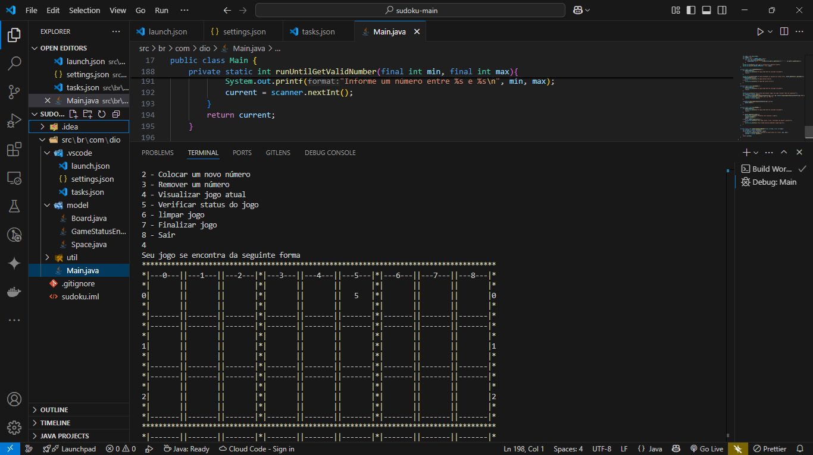

# Jogo do Sudoku em Java

Este é um projeto de um jogo de Sudoku desenvolvido em Java. O objetivo é implementar um jogo funcional de Sudoku, utilizando conceitos de programação orientada a objetos.

---

## Abstração

O jogo foi abstraído para representar um tabuleiro de Sudoku, onde cada célula pode conter um número de 1 a 9. O tabuleiro é composto por linhas e colunas, e o jogador deve preencher os números seguindo as regras do Sudoku.

---

## Encapsulamento

As classes do projeto foram projetadas para esconder os detalhes de implementação, expondo apenas os métodos necessários para interação com o jogo. Isso facilita a manutenção e evolução do código.

---

## Herança

O projeto utiliza herança para organizar as classes relacionadas ao tabuleiro e às células do Sudoku. Isso permite reutilizar código e criar uma estrutura mais clara e modular.

---

## Polimorfismo

O polimorfismo foi aplicado para tratar diferentes tipos de interações com o tabuleiro, como inserir, remover ou verificar números. Isso permite que o código seja mais flexível e extensível.

---

## Novas Funcionalidades (o que foi implementado)

### Menu Interativo

Adicionado um menu no terminal para facilitar a interação com o jogo. As opções disponíveis incluem:

- Iniciar um novo jogo.
- Inserir um número no tabuleiro.
- Remover um número do tabuleiro.
- Visualizar o estado atual do jogo.
- Verificar o status do jogo (se está completo ou contém erros).
- Limpar o tabuleiro.
- Finalizar o jogo.

### Validação de Entrada

- O programa valida as entradas do usuário para garantir que os números inseridos estejam dentro dos limites permitidos (1 a 9).

### Configuração do Tabuleiro

- O tabuleiro é configurado com valores padrão caso nenhuma configuração seja fornecida.

---

## Screenshot



---

## Como Executar

1. Certifique-se de ter o JDK instalado.
2. Compile o projeto:

   ```bash
   javac -d out src/br/com/dio/**/*.java
   ```plaintext

3. Execute o jogo:

   ```bash
   java -cp out br.com.dio.Main
   ```

---

## Estrutura do Projeto

```
sudoku-main
│
├── src
│   └── br
│       └── com
│           └── dio
│               ├── Main.java
│               ├── model
│               │   ├── Board.java
│               │   └── Space.java
│               └── util
│                   └── BoardTemplate.java
├── out
│   └── (arquivos .class gerados pela compilação)
├── screen.png
└── README.md
```

---

## Tecnologias Utilizadas

- **Java 17**: Linguagem de programação utilizada para desenvolver o jogo.
- **Visual Studio Code**: IDE utilizada para desenvolvimento.
- **Git**: Controle de versão para gerenciar o código-fonte.

---

## Contribuição

Sinta-se à vontade para abrir issues ou enviar pull requests para melhorias no projeto.

---

Toda implementação deste código foi

### Toda implementação deste código foi feita seguindo boas práticas de programação orientada a objetos e seguindo as orientações do Expert <www.dio.me>

- [José Luiz Abreu Cardoso Junior](https://www.linkedin.com/in/jos%C3%A9-luiz-abreu-cardoso-junior-18483872/)

### Follow me

- [MARCIO ADRIANO DA SILVA | LinkedIn](https://www.linkedin.com/in/mads1974/)
